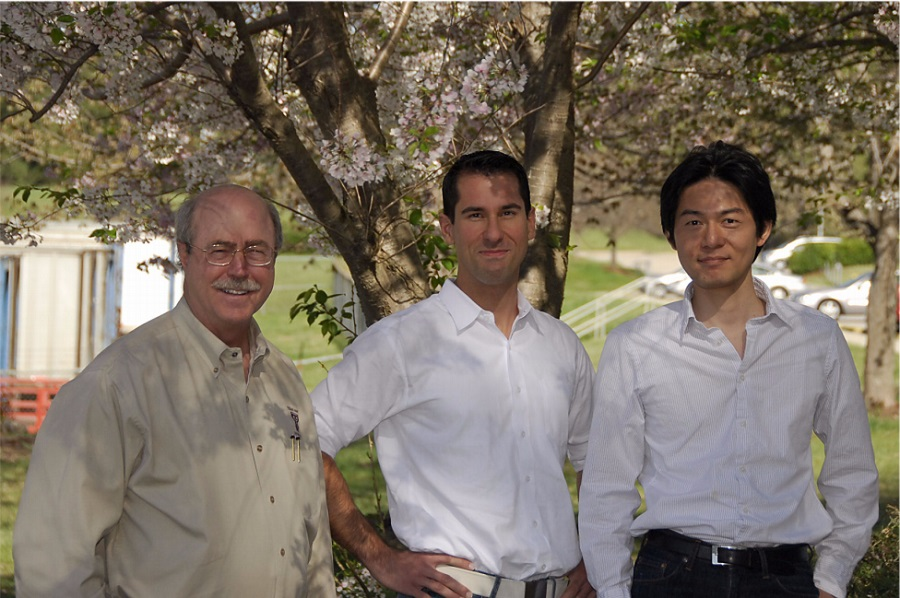

# 前言 {.unnumbered}

Linux® 是一个由来自世界各地的开发者共同开发的一个开源操作系统。Linux 内核源代码是免费提供的，可以在 GNU 通用公共许可证下使用。 该操作系统通常以发行版形式提供给用户，例如 Red Hat 和 Novell 等公司提供的发行版。 一些桌面 Linux 发行版可以从 Web 上免费下载，但服务器版本通常需要购买。

在过去的几年里，Linux 已经进入了全球许多公司的数据中心。Linux 操作系统被科学和企业用户群体所接受。今天，Linux 是迄今为止最通用的操作系统。您可以在嵌入式设备（如防火墙、手机和大型机）上找到 Linux。自然，Linux 操作系统的性能已经成为科学和企业用户的热门话题。但是，计算全球天气预报和托管数据库对操作系统有不同的要求。Linux 必须以最佳性能适应所有可能的使用场景。大多数 Linux 发行版包含通用调优参数以适应所有用户。

IBM® 认为 Linux 是一种适用于在 IBM 系统上运行的企业级应用程序的操作系统。大多数企业应用程序现在都可以在 Linux 上使用，包括文件和打印服务器、数据库服务器、Web 服务器以及协作和邮件服务器。在企业级服务器中使用 Linux 需要监视性能，并在必要时对服务器进行调优，以消除影响用户的瓶颈。本文介绍了可用于优化 Linux 的方法、可用于监视和分析服务器性能的工具，以及特定服务器应用程序的关键优化参数。本文的目的是解释如何分析和调优 Linux 操作系统，以便为您计划在这些系统上运行的任何类型的应用程序提供更好的性能。

在我们的测试环境中使用的调优参数、基准测试结果和监控工具是在 IBM System x™ 服务器和 IBM System z™ 服务器上运行的 Red Hat 和 Novell SUSE Linux 内核 2.6 系统上执行的。然而，本文中的信息应该对所有 Linux 硬件平台都有帮助。

## 本书的结构 {.unnumbered}
为了帮助那些刚接触 Linux 或性能调优的人快速入门，我们按照以下方式构建了这本书：

- 第一章，理解 Linux 操作系统，介绍影响系统性能的因素和 Linux 操作系统对系统资源的管理方式。您将了解量化系统性能所需的几个重要性能指标。
- 第二章，监控和基准测试工具，介绍用于 Linux 测量和分析系统性能的各种实用程序。
- 第三章，分析性能瓶颈，介绍识别和分析系统瓶颈的过程。
- 第四章，操作系统调优，掌握了操作系统如何工作以及如何使用性能度量工具的基本知识后，您就可以研究 Linux 操作系统中可用的各种性能调整了。

## 本书作者 {.unnumbered}
本书是由来自 International Technical Support Organization, Raleigh Center 的世界各地的专家团队编写的。

{width=90%}

**Eduardo Ciliendo** 是一名咨询 IT 专家，在 IBM 瑞士公司担任 IBM Mainframe Systems 的性能专家。他在计算机科学方面有 10 多年的经验。Eddy 在苏黎世大学学习计算机与商业科学，并持有日本学文凭。Eddy 是 zChampion 团队的一员，拥有包括 RHCE 头衔在内的多项 IT 认证。作为 IBM System z™ 的系统工程师，他致力于 z/OS® 和 System z 的 Linux 的容量规划和系统性能。Eddy 撰写了一些关于系统性能和 Linux 的出版物。

**Takechika Kunimasa** 是日本 IBM Global Services 的助理 IT 架构师。他在千叶大学学习电气和电子工程。他在 IT 行业有超过 10 年的经验。他做了五年的网络工程师，一直在 Linux 技术支持部门工作。他的专业领域包括 Linux on System x™、Linux on System p™、Linux on System z、高可用性系统、网络和基础架构设计。他是思科认证网络专业人员和红帽认证工程师。

**Byron Braswell** 是国际技术支持组织罗利中心的网络专业人员。他获得了德克萨斯农工大学的物理学学士学位和计算机科学硕士学位。他在网络、应用集成中间件和个人计算机软件领域写了大量的文章。在加入 ITSO 之前，Byron 曾在 IBM Learning Services Development 从事网络教育开发工作。

还要感谢以下人员对这个项目的贡献：

Margaret Ticknor
Carolyn Briscoe
International Technical Support Organization, Raleigh Center

Roy Costa
Michael B Schwartz
Frieder Hamm
International Technical Support Organization, Poughkeepsie Center

Christian Ehrhardt
Martin Kammerer
IBM Böblingen, Germany

Erwan Auffret
IBM France